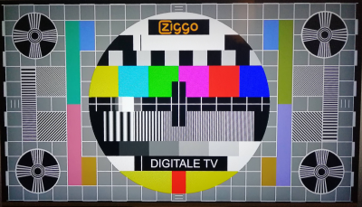
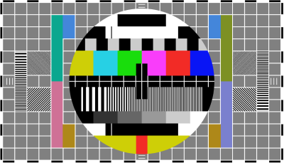

# Test Screen

When I was a kid, I often viewed the test screen on our TV and wondered if I could recreate it. Now, 40 years later, I did it. And I plan to expand it with lots more functions.

> Demo at https://raw.githack.com/MakePixelsWork/Test-Screen/master/index.htm

# Process
This test screen is based on the Dutch Ziggo test screen which is transmitted on a channel to test the colors of your set. I took a photograph and used it as a basis for a design build in Figma.

&nbsp;&nbsp;&nbsp;&nbsp;&nbsp;&nbsp;

When I was satisfied with the design (minus the weird surrounding circles), it was time to recreate this in code. I choose to build it in vanilla CSS, because I wanted to learn to apply variables and calculations. I've build sites in pure CSS for over 15 years, but am more of a Sass person these days. But I wanted to use a non-compiler language for this project, so anyone can use it. Its also nice to challenge myself, to learn new stuff from old methods.

# Variable sizes
I initially just winged the size, but soon decided that the squares should be 150px... and their white-space should be 10px. Its just easier to calculate things. In hindsight a good decision, because all squares are related to eachother and their white space, which you will find out of you check the code.

Not soon after the 10px white-space was created, I decided that its better to use margins of 5px, on all sides of the squares and rectangles. This way it became a lot easier to build the HTML structure. Later it also became easier to calculate the different sizes.

> You can in-/decreasing the size of the test screen, by changing the '--divider' var. If you enter the number 1, all squares will be 150px, resulting in a huge screen. If you enter the number 2, the size of the test screen will be recalculated and present squares of 75px (150 / 2), with all other spacing, margins, images* etcetera being recalculated to their respective sizes.

\* Images are set to 'contain' their divs, so will scale automatically. I've yet to devise a plan on how to create them in a non-image format. To be continued.

# Future plans (to be decided)
- Adding a slider/form that changed the size of the --divider var.
- Changing test screen based on viewport. Probably with vw and vh.
- Creating more formats and/or other test screens
- Creating funny test screens, like a smiley, etc.
- Creating monochrome or other weird test screens.
- And lots more.

# Copyright
Since I do not own the original rights to this test screen, I have chosen for an MIT License. Feel free to use it, but please reference me as the original code creator. The design is not mine, the code is.
